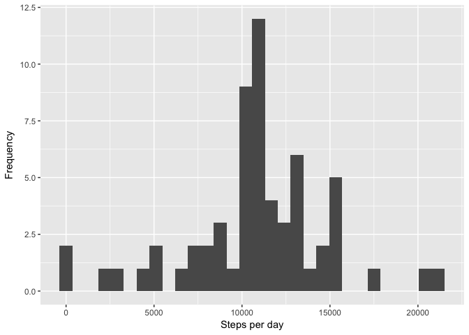

# Reproducible Research - Assignment 2
06-May-2017  


## Data

The data for this assignment can be downloaded from the course web
site:

* Dataset: [Activity monitoring data]
(https://d396qusza40orc.cloudfront.net/repdata%2Fdata%2Factivity.zip) [52K]

The variables included in this dataset are:

* **steps**: Number of steps taking in a 5-minute interval (missing
    values are coded as `NA`)

* **date**: The date on which the measurement was taken in YYYY-MM-DD
    format

* **interval**: Identifier for the 5-minute interval in which
    measurement was taken

The dataset is stored in a comma-separated-value (CSV) file and there
are a total of 17,568 observations in this
dataset.


## Assignment


```r
library(dplyr)
```

```
## 
## Attaching package: 'dplyr'
```

```
## The following objects are masked from 'package:stats':
## 
##     filter, lag
```

```
## The following objects are masked from 'package:base':
## 
##     intersect, setdiff, setequal, union
```

```r
library(tidyr)
library(ggplot2)
```

#### Loading and preprocessing the data

1. Load the data (i.e. `read.csv()`)


```r
if (!file.exists("actvity.csv")){
    unzip("activity.zip")
} else {
    print("file exists")
}

act_df <- read.csv("activity.csv",
                     stringsAsFactors = FALSE)
act_df <- tbl_df(act_df)

glimpse(act_df)
```

```
## Observations: 17,568
## Variables: 3
## $ steps    <int> NA, NA, NA, NA, NA, NA, NA, NA, NA, NA, NA, NA, NA, N...
## $ date     <chr> "2012-10-01", "2012-10-01", "2012-10-01", "2012-10-01...
## $ interval <int> 0, 5, 10, 15, 20, 25, 30, 35, 40, 45, 50, 55, 100, 10...
```

2. Processing/transforming the data into a format suitable for  analysis

* Setting date column in the right format


```r
act_df <- act_df %>%
    mutate(date = as.Date(date, format = "%Y-%m-%d"))
```

Making two data frames
* One with all the NA's removed
* One with all the NA's replaced with zeros


```r
act_na_omit <- act_df %>% 
    na.omit()

act_na_replaced <- act_df %>%
    mutate(steps = ifelse(is.na(steps), 0, steps))
```


### What is mean total number of steps taken per day?

As instructed, ignoring the missing values in the dataset.

1. A histogram of the total number of steps taken each day. 


```r
g <- act_na_omit %>%
    group_by(date) %>%
    summarise(total = sum(steps))
    
ggplot(g, aes(total)) +
    geom_histogram() +
    labs(x = "Steps per day", y = "Frequency")
```

```
## `stat_bin()` using `bins = 30`. Pick better value with `binwidth`.
```

<!-- -->


2. Calculating the **mean** and **median** total number of steps taken per day


```r
mean(g$total)
```

```
## [1] 10766.19
```

```r
median(g$total)
```

```
## [1] 10765
```

The mean is 10766 (rounded off) steps and the median is 10765.

### What is the average daily activity pattern?

1. Time series plot of the 5-minute interval (x-axis) and the average number of steps taken, averaged across all days (y-axis)

2. Marked in red, the 5-minute interval, on average across all the days in the dataset, containing the maximum number of steps. The
green line is the overall average.


```r
g2 <- act_na_omit %>%
    group_by(interval) %>%
    summarise(avg.steps = mean(steps))

maxg2 <- g2 %>%
    filter(avg.steps == max(avg.steps))

ggplot(g2, aes(interval, avg.steps)) +
    geom_line(col = "blue") +
    geom_hline(yintercept = mean(g2$avg.steps), color = "green") +
    labs(x = "Interval [min]", y = "Average steps") +
    geom_point(data = maxg2, aes(interval, avg.steps), col = "red")+
    geom_point(data = maxg2, aes(interval, 0), col = "red")+
    geom_segment(data = maxg2,
                 aes(x = interval, y = 0,
                     xend = interval, yend = avg.steps),
                 col = "red") +
    geom_label(data = maxg2,
              aes(x = interval, y = avg.steps, 
                  label = paste("Max:", 
                                as.integer(maxg2$avg.steps), "steps")),
              hjust = -0.25, vjust = 0.5) +
    geom_label(data = maxg2,
              aes(x = interval, y = 0, 
                  label = paste("Interval:", interval)),
              hjust = -0.25, vjust = 0)
```

<!-- -->


### Imputing missing values
Note that there are a number of days/intervals where there are missing
values (coded as `NA`). The presence of missing days may introduce
bias into some calculations or summaries of the data.

1. Calculating the total number of missing values in the dataset (i.e. the total number of rows with `NA`s)


```r
mean(is.na(act_df$steps))
```

```
## [1] 0.1311475
```

```r
mean(is.na(act_df$date))
```

```
## [1] 0
```

```r
mean(is.na(act_df$interval))
```

```
## [1] 0
```

```r
sum(is.na(act_df$steps))
```

```
## [1] 2304
```


2. One strategy for filling in all of the missing values in the dataset is to use the mean for that 5-minute interval.

3. Now a new dataset that is equal to the original dataset but with the missing data filled in is created.


```r
# first replace missing steps by avg for that interval
dim(act_df)
```

```
## [1] 17568     3
```

```r
new_df <- act_df %>% 
    left_join(g2, by = "interval") %>%
    mutate(steps = ifelse(is.na(steps), avg.steps, steps)) %>%
    select(steps, date, interval)
dim(new_df)
```

```
## [1] 17568     3
```

```r
sum(is.na(new_df$steps))      
```

```
## [1] 0
```

4. A histogram of the total number of steps taken each day. 


```r
g3 <- new_df %>%
    group_by(date) %>%
    summarise(total = sum(steps))

ggplot(g3, aes(total)) +
    geom_histogram() +
    labs(x = "Steps per day", y = "Frequency")
```

```
## `stat_bin()` using `bins = 30`. Pick better value with `binwidth`.
```

<!-- -->

Also calculating the **mean** and **median** total number of steps taken per day. 


```r
mean(g3$total)
```

```
## [1] 10766.19
```

```r
median(g3$total)
```

```
## [1] 10766.19
```

The mean and the median are 10766 (rounded off).

Now comparing the total steps between the two datasets
with NA and the one with data imputed.


```r
withna <- act_na_replaced %>%
    group_by(date) %>%
    summarise(total = sum(steps))
    
newg <- withna %>%    
    left_join(g3, by = "date") %>%
    gather(hasna, steps, total.x, total.y) %>%
    mutate(hasna = ifelse(hasna == "total.x", "TRUE", "FALSE"),
           hasna = as.factor(hasna))

ggplot(newg, aes(date, steps, col = hasna)) +
    geom_line() +
    labs(x = "Day", y = "Total steps")
```

<!-- -->

These values do not differ from the estimates from the first part of the assignment. Thus the impact of imputing missing data on the estimates of the total daily number of steps is minimal.


### Are there differences in activity patterns between weekdays and weekends?

Using the dataset with the filled-in missing values for this part.

1. A new factor variable in the dataset with two levels -- "weekday" and "weekend" is created to indicate whether a given date is a weekday or weekend day.


```r
new_df2 <- new_df %>%
    mutate(days = ifelse(weekdays(date) %in% c("Saturday", "Sunday"),
                         "weekend", "weekday"),
           days = as.factor(days)) %>%
    group_by(interval, days) %>%
    summarise(avg.steps = mean(steps))
```

2. Now a panel plot containing a time series plot of the 5-minute interval (x-axis) and the average number of steps taken, averaged across all weekday days or weekend days (y-axis) is shown. 


```r
ggplot(new_df2, aes(interval, avg.steps))+
    geom_line(col = "blue") + 
    facet_grid(days~.) +
    labs(x = "Interval [min]", y = "Average steps")
```

<!-- -->


